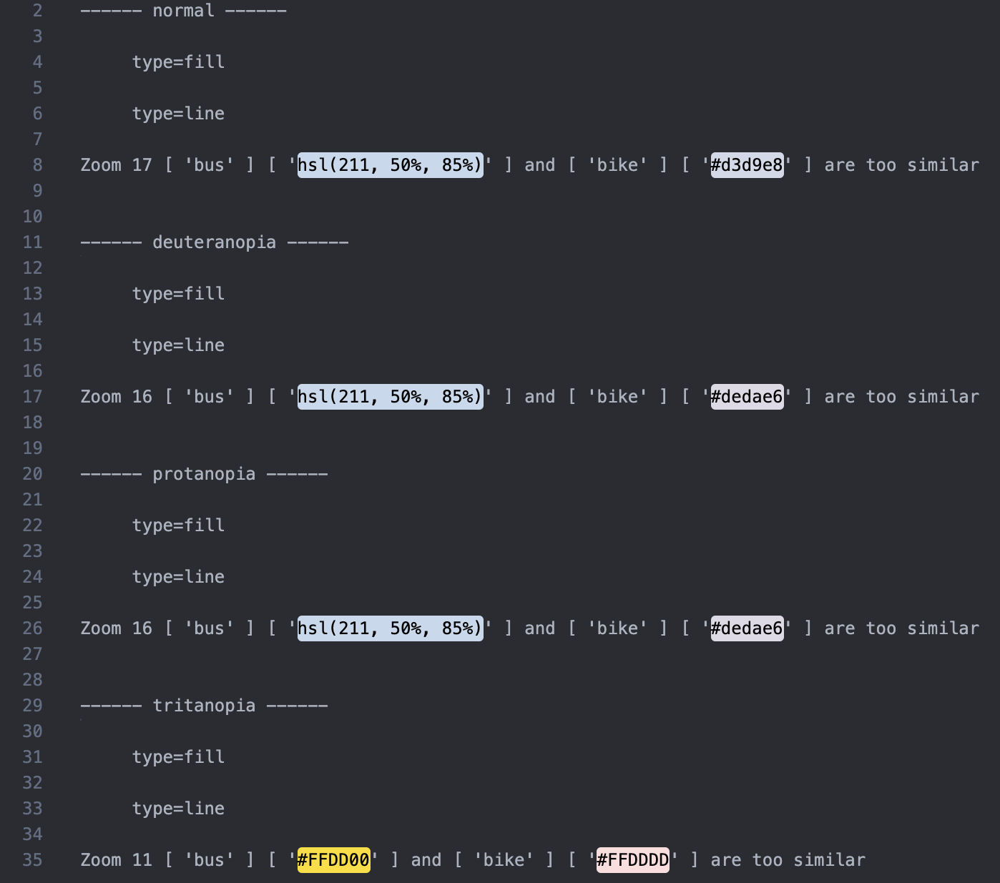

# Color-Unclasher

Designed to help developers make their Maplibre styles more accessible to users with color blindness! This tool analyzes color combinations within a style specification and reports any non-compliant pairs, based on if the color of two layers at the same zoom level have enough DeltaE difference.

The result could be in human readable format (written to terminal or a file) or just data structures exported to another file. 

The exported file for non-compliant pairs in a specific data structure could be used to specify pairs to ignore in future analyses.

# For people that want to help test it out
First of all, thank you so much! The workflow is suggested bellow and it would be very helpful if you can read through this README and tell me if there are anything vague or needs to be changed/added. Reach me through slack! 

If you would like to, run the packge! For simple test files, use case.json or simple.json in the test folder, but you could also use your own style specification! Put it in the test folder and run the package. Things might not work perfelectly since there are expressions that are not yet supported.


Installation:

```sh
git clone https://github.com/osm-americana/color-unclasher.git
cd color-unclasher
cd package
npm install
npm link color-unclasher
cd ..
cd test
npm link color-unclasher
```

# Supported And Not Supported Expressions
Supports:
-  steps
-  stops
-  interpolate
-  interpolate with one layer of match
-  case

Not supported:
- nested match
- in

...
  
# Recommendation

Install extensions that would show colors specified in your document. For example, Color Highlight in VS Code.

# Usage and flags

In terminal, provide the path to your style specification. If you would like to store the human readable analyzes result, enter a file path. Or else, result would be written to terminal.

```sh
color-unclasher styleSpecPath [analyzeResultFilePath]
```

To override default values or declare path to export to or import from, use the following flags:

| Flag  | Default Value | Explanation |
| :------------ |:---------------:| :-----:|
| --export-pairs-path     | null | The path the non-compliant pairs would be exported to |
| --min-zoom      | 0        |  The minimum zoom level |
| --max-zoom | 22       |   The maximum zoom level |
| --min-deltaE | 5.5       |   The minimum DeltaE for a compliant pair |
| --pairs-to-ignore-path| null       |  The path to import non-compliant pairs to ignore |

# Example Workflow
1.  **Run analysis in terminal with the flag --export-pairs-path**: Result in human readable format would be written result.txt. output.json would be created for non-compliant pairs stored in a specific data structure.

```sh
color-unclasher styles.json result.txt --export-pairs-path output.json
```

Whats written to result.txt


Whats written to output.json

```js
{
  "normal": {
    "fill": {
      "6": [[["airport"], ["grass"]]]
    },
    "line": {
      "17": [[["bus"], ["bike"]]]
    }
  },
  "deuteranopia": {
    "fill": {
      "6": [[["airport"], ["grass"]]]
    },
    "line": {
      "16": [[["bus"], ["bike"]]]
    }
  },
  "protanopia": {
    "fill": {
      "6": [[["airport"], ["grass"]]]
    },
    "line": {
      "16": [[["bus"], ["bike"]]]
    }
  },
  "tritanopia": {
    "fill": {
      "6": [[["airport"], ["grass"]]]
    },
    "line": {
      "11": [[["bus"], ["bike"]]]
    }
  }
}
```

2. **Edit output.json to specify pairs to ignore in future analyzes**: Let's say I am not worried about "airport" and "grass" having similar colors, then I would **leave** pairs with "airport" and "grass" in output.json, and delete the rest. output.json should now look like:

```js
{
  "normal": {
    "fill": {
      "6": [[["airport"], ["grass"]]]
    },
    "line": {}
  },
  "deuteranopia": {
    "fill": {
      "6": [[["airport"], ["grass"]]]
    },
    "line": {}
  },
  "protanopia": {
    "fill": {
      "6": [[["airport"], ["grass"]]]
    },
    "line": {}
  },
  "tritanopia": {
    "fill": {
      "6": [[["airport"], ["grass"]]]
    },
    "line": {}
  }
}
```

Run analysis in terminal with the flag --export-pairs-path**

3. **Analyze again and with flag --export-pairs-path followed by output.json**:

```sh
color-unclasher style.json result.txt --pairs-to-ignore-path output.json
```

Then the result written to result.txt would no longer have the pairs configured to ignore



# Get adjusted colors via module

```js
import ColorUnclasher from "color-unclasher";

const color1 = "#a4a95b"; // wouldn't be modified
const color2 = "#ff8375"; // be based on by adjusted colors 

/*
  Result:
  {
    red_increase: '----', // means no possible result
    red_decrease: '#da8375',
    green_increase: '#ffa875',
    green_decrease: '#ff5e75',
    blue_increase: '#ff8387',
    blue_decrease: '#ff833a'
  }
*/
const newColors = ColorUnclasher.adjustRGB(color1, color2, deuteranopia);
```
