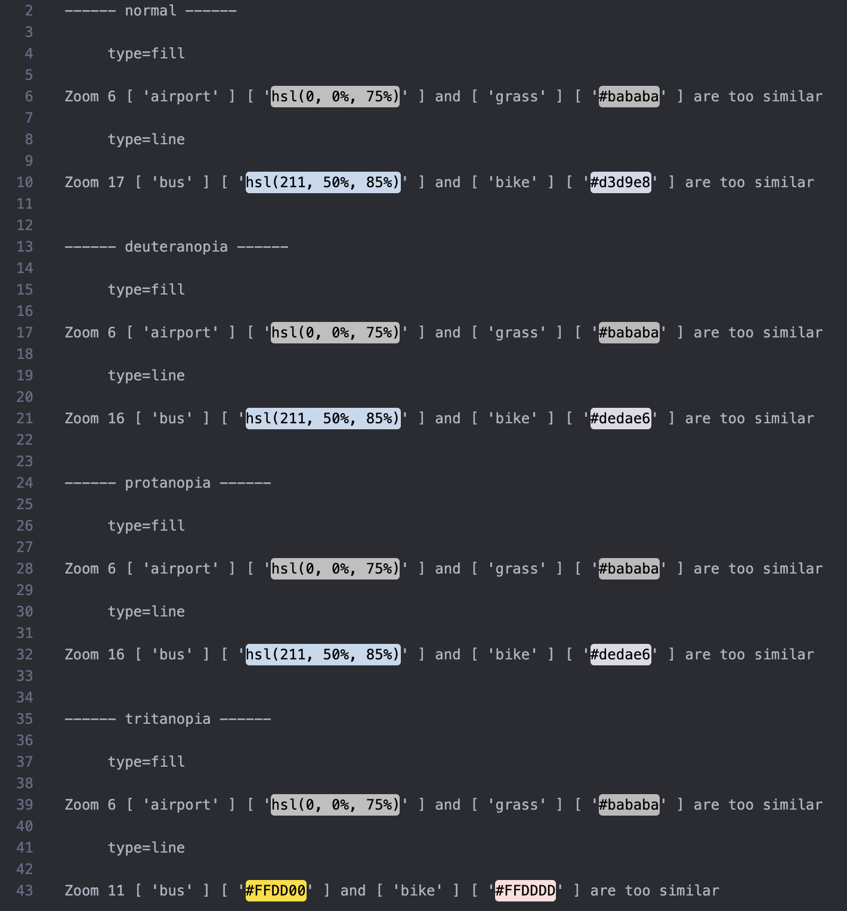

# Color-Unclasher

Color-Unclasher is designed to help developers making their style specifications more accessible to users with color blindness. This tool analyzes color combinations within a style specification and reports any non-compliant pairs. 

The result could be in human readable format (written to terminal or a file) or just data structures exported to another file. 

The exported file for non-compliant pairs in a specific data structure could be used to specify pairs to ignore in future analyses, by providing its filename when prompted "Enter file path for non-compliant pairs to ignore" in terminal.

# Recommendation

Install extensions that would show colors specified in your document. For example, Color Highlight in VS Code.

# Example Workflow
1.  **Run Analysis In Terminal with the Optional Flag --export-pairs-path Followed By a File Path**

Result in human readable format would be written to terminal when no outPutPath is specified

A file would be written to outPutPairPath for non-compliant pairs stored in data structure 
```sh
color-unclasher filePath [outPutPath] --export-pairs-path outPutPairPath
```

Then answer the questions:
```sh
? Enter the minimum DeltaE for enough difference: 5.5
? Enter the minimum and maximum zoom level (comma-separated): 0,22
? Enter file path for non-compliant pairs to ignore: 
```

Whats written to filePath (suggested file format is .txt)



Whats written to non-compliant pairs file

```js
{
  "normal": {
    "fill": {
      "6": [[["airport"], ["grass"]]]
    },
    "line": {
      "17": [[["bus"], ["bike"]]]
    }
  },
  "deuteranopia": {
    "fill": {
      "6": [[["airport"], ["grass"]]]
    },
    "line": {
      "16": [[["bus"], ["bike"]]]
    }
  },
  "protanopia": {
    "fill": {
      "6": [[["airport"], ["grass"]]]
    },
    "line": {
      "16": [[["bus"], ["bike"]]]
    }
  },
  "tritanopia": {
    "fill": {
      "6": [[["airport"], ["grass"]]]
    },
    "line": {
      "11": [[["bus"], ["bike"]]]
    }
  }
}
```

2. **Edit Non-compliant Pairs File For Pairs To Ignore**:
Lets say I am not worried about "airport" and "grass" having similar colors, then I would **leave** pairs with "airport" and "grass" in the file, and delete the rest. The edited file should look like 
```js
{
  "normal": {
    "fill": {
      "6": [[["airport"], ["grass"]]]
    },
    "line": {}
  },
  "deuteranopia": {
    "fill": {
      "6": [[["airport"], ["grass"]]]
    },
    "line": {}
  },
  "protanopia": {
    "fill": {
      "6": [[["airport"], ["grass"]]]
    },
    "line": {}
  },
  "tritanopia": {
    "fill": {
      "6": [[["airport"], ["grass"]]]
    },
    "line": {}
  }
}
```

3. **Feed The File Back In When Analyzing Again**:

```sh
color-unclasher filePath outPutPath
```
Then when answering  the questions:
```sh
? Enter the minimum DeltaE for enough difference: 5.5
? Enter the minimum and maximum zoom level (comma-separated): 0,22
? Enter file path for non-compliant pairs to ignore: **path to the edited file**
```

Then the result written to outPutPath would no longer have the pairs configured to ignore


# Get adjusted colors via module

```js
import ColorUnclasher from "color-unclasher";

const color1 = "#a4a95b"; // wouldn't be modified
const color2 = "#ff8375"; // be based on by adjusted colors 

/*
  Result:
  {
    red_increase: '----', // means no possible result
    red_decrease: '#da8375',
    green_increase: '#ffa875',
    green_decrease: '#ff5e75',
    blue_increase: '#ff8387',
    blue_decrease: '#ff833a'
  }
*/
const newColors = ColorUnclasher.adjustRGB(color1, color2, deuteranopia);
```
