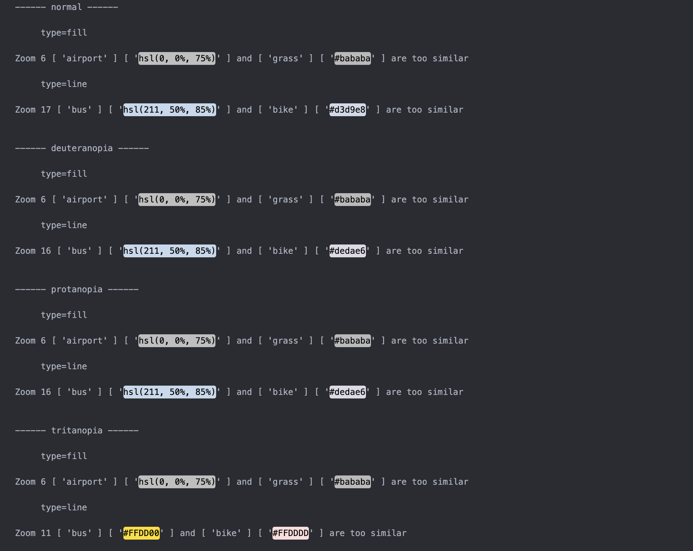
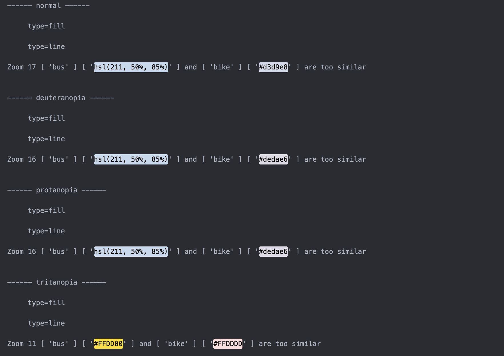
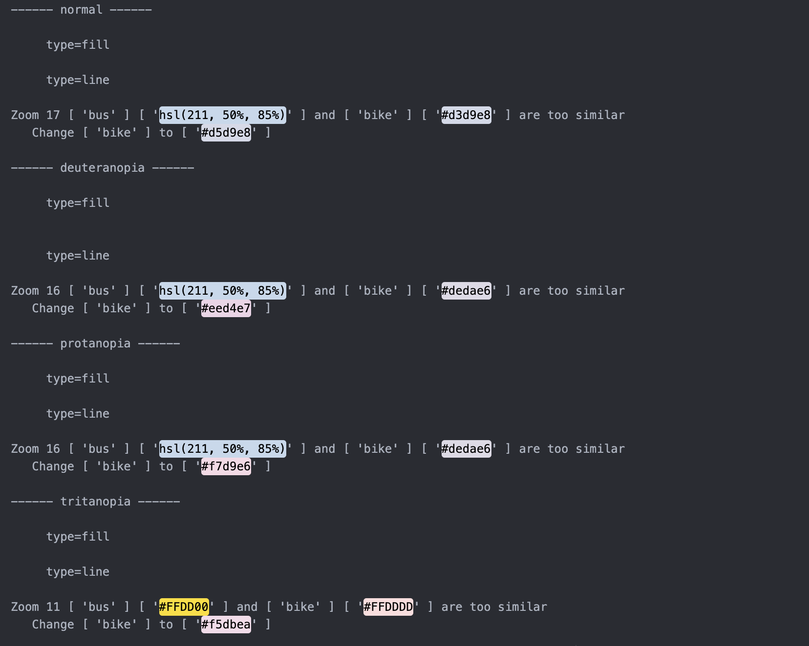

# Color-Unclasher

Designed to help developers make their Maplibre styles more accessible to users with color blindness! This tool analyzes color combinations within a style specification and reports any non-compliant pairs. Compliance is determined by checking if the colors of two layers at the same zoom level, when transformed to simulate different types of color blindness, have a sufficient DeltaE difference.

The result could be in human readable format (written to terminal or a file) or just data structures exported to another file. 

The exported file for non-compliant pairs in a specific data structure could be used to specify pairs to ignore in future analyses.

# Background information

`Color perceptions considered in the project`

| Name | Type  | Cause |
| :------------ |:---------------| :---------------|
| Normal Vision | No color blindness | Has all red, green, and blue cones |
| Protanopia | Red-Green blindness | No red cone |
| Deuteranopia | Red-Green blindness | No green cone |
| Trianopia | Blue-Yellow blindness | No blue cone |


`What is DeltaE?`

DeltaE (CIE 2000) is a metric for how the human eye percieves color difference, with 0 being no difference and 100 being maximum difference. This package uses chroma.js's deltaE function, which is based on the formula from [Bruce Lindbloom](http://www.brucelindbloom.com/index.html?Eqn_DeltaE_CIE2000.html). 

`Why use DeltaE instead of color contrast ratio?`

Color contrast ratio, based on the relative brightness of the RGB values, is mostly used for getting the contrast between a peice of text and its background color, which the former would hold significantly less space than a tile on a map.  `#475C5C` and  `#515062` would fail for color contrast, but they have enough difference for two adjacent tiles on a map. Read more about DeltaE [here](https://techkonusa.com/demystifying-the-cie-%CE%B4e-2000-formula/).

# Supported and unsupported expressions
Supports:
-  steps
-  stops
-  interpolate
-  interpolate with one layer of match
-  case

Not supported:
- nested match
- in

...
  
# Recommendations

1.  Install extensions that would show colors specified in your document. For example, [Color Highlight](https://marketplace.visualstudio.com/items?itemName=naumovs.color-highlight) in VS Code.

2.  If you want to experiement with what minimum DeltaE you want to use, or check the DeltaE, color contrast, and how two colors would look with different types of color blindness, go to https://leonardocolor.io/tools.html. You can use  `#475C5C` and  `#515062` as an example. They have DeltaE of 5.56 for Deuteranopia, 7.95 for Protanopia, and 6.46 for Tritanopia.

3.  To check how a group of color looks for people with different types of color-blindness, go to https://color.adobe.com/create/color-accessibility and select Color Blind Safe on the left column.

# Usage and flags

In terminal, provide the path to your style specification. If you would like to store the human readable analyzes result, enter a file path. Or else, result would be written to terminal.

```sh
color-unclasher styleSpecPath [analyzeResultFilePath]
```

To override default values or declare path to export or import data from, use the following flags:

| Flag  | Default Value | Explanation |
| :------------ |:---------------:| :-----:|
| --export-pairs-path     | null | The path the non-compliant pairs would be exported to |
| --min-zoom      | 0        |  The minimum zoom level |
| --max-zoom | 22       |   The maximum zoom level |
| --min-deltaE | 5.5       |   The minimum DeltaE for a compliant pair |
| --pairs-to-ignore-path| null       |  The path to import non-compliant pairs to ignore |
| --get-suggest | false | Get suggested change of color for non-compliant pairs |

# Example workflow
1.  **Run analysis in terminal with the flag --export-pairs-path**: Result in human readable format would be written to result.txt. output.json would be created for non-compliant pairs stored in a specific data structure.

```sh
color-unclasher styles.json result.txt --export-pairs-path output.json
```

Whats written to result.txt



Whats written to output.json

```js
{
  "normal": {
    "fill": {
      "6": [[["airport"], ["grass"]]]
    },
    "line": {
      "17": [[["bus"], ["bike"]]]
    }
  },
  "deuteranopia": {
    "fill": {
      "6": [[["airport"], ["grass"]]]
    },
    "line": {
      "16": [[["bus"], ["bike"]]]
    }
  },
  "protanopia": {
    "fill": {
      "6": [[["airport"], ["grass"]]]
    },
    "line": {
      "16": [[["bus"], ["bike"]]]
    }
  },
  "tritanopia": {
    "fill": {
      "6": [[["airport"], ["grass"]]]
    },
    "line": {
      "11": [[["bus"], ["bike"]]]
    }
  }
}
```

2. **Edit output.json to specify pairs to ignore in future analyses**: Let's say I am not worried about "airport" and "grass" having similar colors, then I would **leave** pairs with "airport" and "grass" in output.json, and delete the rest. output.json should now look like:

```js
{
  "normal": {
    "fill": {
      "6": [[["airport"], ["grass"]]]
    },
    "line": {}
  },
  "deuteranopia": {
    "fill": {
      "6": [[["airport"], ["grass"]]]
    },
    "line": {}
  },
  "protanopia": {
    "fill": {
      "6": [[["airport"], ["grass"]]]
    },
    "line": {}
  },
  "tritanopia": {
    "fill": {
      "6": [[["airport"], ["grass"]]]
    },
    "line": {}
  }
}
```

3. **Analyze again and with flag --pairs-to-ignore-path followed by output.json**:

```sh
color-unclasher style.json result.txt --pairs-to-ignore-path output.json
```

Then the result written to result.txt would no longer have the pairs configured to ignore



4. **Get suggested change of color for non-compliant pairs with --get-suggest**:

```sh
color-unclasher style.json result.txt --pairs-to-ignore-path output.json --get-suggest true
```



Color on the right hand side will be modified. Due to how suggested colors are 
generated, there is a bias for a increase in redness. Read the last section 
for more information.

# Dev

After downloading the code

```sh
npm install
npm link
cd test
npm link color-unclasher
```

Then you can make changes to the code in src folder and test in test folder

# Get adjusted colors

Two exported functions, adjustRGB and adjustHSL are available to get suggested 
colors on your own. They both suggest colors by increasing or decreasing red, 
green, or blue, or hue, saturation, and lightness at a time. The returned
object will contain suggestions that meet the min DeltaE threshold. 

In automatic suggestions mentioned in example workflow, testing suggested colors
with other existing colors will start with the first color in result, which would
be color with red increase for RGB colors, and hue increase for HSL colors. Therefore,
automatic suggestions have a bias for these two kind of colors.

If you would like to view all suggested colors to pick a color on your own, in a JS file, use it as the following.

```js
import ColorUnclasher from "color-unclasher";

const color1 = "#a4a95b"; // wouldn't be modified
const color2 = "#ff8375"; // have a deltaE of 2.81 with color1
const mode = 'deuteranopia'; // one of protanopia, deuteranopia, and trianopia
const minDeltaE = 7; // defaulted to 7

/*
  Result:
  {
    red_increase: '----', // means no possible result
    red_decrease: '#da8375',
    green_increase: '#ffa875',
    green_decrease: '#ff5e75',
    blue_increase: '#ff8387',
    blue_decrease: '#ff833a'
  }
*/
const newColors = ColorUnclasher.adjustRGB(color1, color2, mode, minDeltaE);
```

color1 = `#a4a95b`   color2 = `#ff8375` 

red_increase: '----',

red_decrease: '#da8375' ,

green_increase: '#ffa875' ,

green_decrease: '#ff5e75' ,

blue_increase: '#ff8387' ,

blue_decrease: '#ff833a' 
